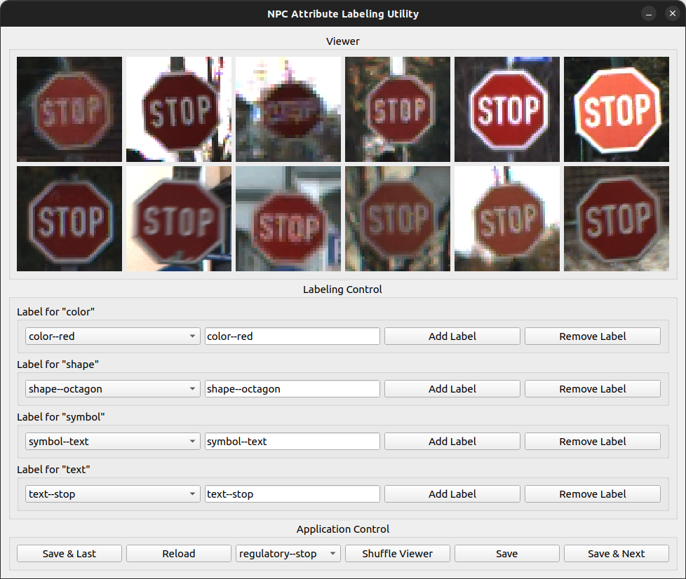
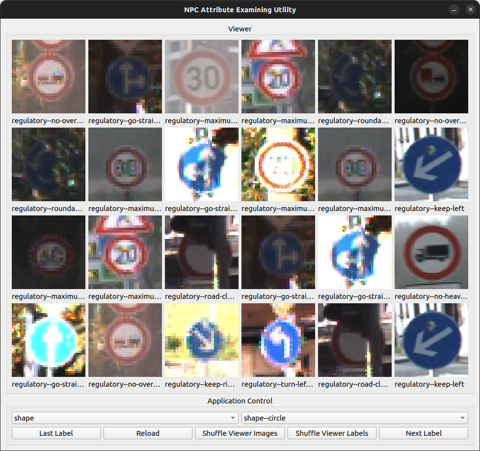

# NPC Dataset Utilities

## Table of Contents

1. [Project Overview](#project-overview)
1. [Project Prerequisites](#project-prerequisites)
1. [Project Hierarchy](#project-hierarchy)
1. [Setting Up the Datasets](#setting-up-the-datasets)
1. [NPC Attribute Utilities](#npc-attribute-utilities)
1. [Acknowledgements](#acknowledgements)
1. [License](#license)

## Project Overview

This codebase provides utilities for processing and manipulating datasets for the Neural Probabilistic Circuit (NPC) project. The NPC project focuses on the following four datasets:

- [Animals with Attributes 2 (AwA2)](https://cvml.ista.ac.at/AwA2/)
- [CelebFaces Attributes (CelebA)](https://mmlab.ie.cuhk.edu.hk/projects/CelebA.html)
- [German Traffic Sign Recognition Benchmark (GTSRB)](https://www.kaggle.com/datasets/meowmeowmeowmeowmeow/gtsrb-german-traffic-sign)
- [Modified National Institute of Standards and Technology (MNIST)](https://www.kaggle.com/datasets/hojjatk/mnist-dataset)

Scripts are provided for each dataset to process and organize them into the format and structure required by the NPC pipeline. For the NPC project, the MNIST dataset is further processed into the _MNIST Addition_ dataset, as described in this [paper](https://proceedings.neurips.cc/paper_files/paper/2018/file/dc5d637ed5e62c36ecb73b654b05ba2a-Paper.pdf).

Certain datasets, such as GTSRB, lack attribute labels. To address this, the codebase includes a set of Qt-based graphical software that allow users to create and examine attribute labels for any dataset. A verification script is included to check the consistency and correctness of user-created labels.

In addition, utility scripts are available for splitting datasets into training, validation, and testing subsets, and for generating Probabilistic Circuit (PC) datasets from those splits. These PC datasets are then used by the `learnspn` project to construct and generate PCs.

## Project Prerequisites

This project was developed and tested on Ubuntu 22.04 LTS and requires the following system packages:

```bash
apt install python3-natsort python3-numpy python3-opencv python3-pil python3-pyqt5 python3-tqdm unzip
```

Other Linux distributions, macOS, or Windows Subsystem for Linux (WSL) may also work with additional efforts. However, these platforms are not officially supported.

Before running any script, review `header.py` and ensure that all relevant parameters are set to the desired values. More detailed instructions on specific parameters is provided in later sections.

## Project Hierarchy

This project is part of the NPC pipeline. To ensure compatibility and maintain consistent references across the pipeline, organize the project directories as follows:

    npc
    ├── datasets
    │   ├── awa2
    │   ├── celeba
    │   ├── gtsrb
    │   └── mnist
    ├── learnspn
    ├── npc-dataset-utils
    └── npc-models

All subsequent instructions assume the above project hierarchy.

The `npc/datasets` directory does not exist by default. Create the initial directory structure as follows:

```bash
cd npc/datasets
mkdir -pv awa2 celeba gtsrb mnist
```

## Setting Up the Datasets

Detailed instructions for setting up and organizing dataset contents within npc/datasets are provided in the following documents:

- [Animals with Attributes 2 (AwA2)](docs/npc-dataset-utils/datasets/awa2.md)
- [CelebFaces Attributes (CelebA)](docs/npc-dataset-utils/datasets/celeba.md)
- [German Traffic Sign Recognition Benchmark (GTSRB)](docs/npc-dataset-utils/datasets/gtsrb.md)
- [Modified National Institute of Standards and Technology (MNIST)](docs/npc-dataset-utils/datasets/mnist.md)

## NPC Attribute Utilities

The NPC attribute utilities allow users to create and review dataset attribute labels. Detailed usage instructions are available in the following documents:

- [NPC Attribute Labeling Utility](docs/npc-dataset-utils/utilities/label.md)
- [NPC Attribute Examining Utility](docs/npc-dataset-utils/utilities/examine.md)

Preview of the NPC attribute utilities:




## Acknowledgements

I would like to express my gratitude to Rahim Khan, Tommy Tang,
Alex Tanthiptham, and Trusha Vernekar for their contributions to the implementations, testing, and experiments for the NPC projects.

## License

This codebase is released under the [Creative Commons Attribution NonCommercial ShareAlike (CC BY-NC-SA)](https://creativecommons.org/licenses/by-nc-sa/4.0/deed.en) license, which can be viewed under `LICENSE`.

Written by [Simon Yu](https://www.simonyu.net/).
